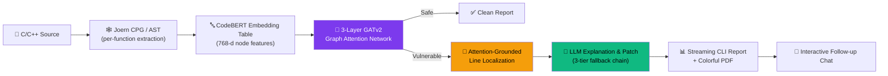

<div align="center">

# 🛡️ DePatchX

### Attention-Grounded Explainable Graph Neural Network Framework for Vulnerability Detection & Automated Patch Generation in C/C++

*From raw source code → structural graph reasoning → explainable localization → LLM-authored patch — in one CLI.*

[](https://www.python.org/)
[](https://pytorch.org/)
[](https://pytorch-geometric.readthedocs.io/)
[](https://joern.io/)
[](https://ollama.com/)
[](https://github.com/Textualize/rich)
[](#license)

[](#-results)
[](#-results)
[](#-results)

</div>

---

## 📖 Overview

**DePatchX** is an end-to-end static application security testing (SAST) system for **C/C++** that goes beyond a black-box "vulnerable / safe" label. It builds a **per-function Code Property Graph** from your source using **Joern**, classifies each function with a **3-layer GATv2 Graph Attention Network**, and — instead of bolting on a post-hoc explainer — reads the network's **own first-layer attention weights** to point at the *exact lines* that drove the verdict. Those grounded findings are then handed to a locally hosted LLM (**deepseek-coder** via **Ollama**) to produce a human-readable root-cause explanation, a CWE classification, and a secure patch — with a fully offline, deterministic fallback so the tool never returns an empty response.

> 📄 This repository is the reference implementation for the paper *"DePatchX: An Attention-Grounded Explainable Graph Neural Network Framework for Vulnerability Detection and Automated Patch Generation in C/C++ Source Code."*

---

## ✨ Key Features

| | |
|---|---|
| 🧠 **Structural detection** | 3-layer **GATv2** encoder over per-function AST/CPG graphs, not flattened token sequences |
| 🔍 **Native explainability** | Localization comes from the classifier's **own attention weights** — no separate GNNExplainer/surrogate model needed |
| 🎯 **Line-level precision** | Attention is aggregated per source node and mapped back to **exact line numbers**, ranked top-k |
| 🩹 **Integrated remediation** | Root-cause explanation, CWE mapping, and a secure rewrite — generated from the same localized evidence used for detection |
| 🔌 **Offline-first, 3-tier fallback** | Local LLM (Ollama) → optional cloud LLM (OpenRouter) → deterministic rule-based report from raw attention scores — always returns *something* |
| ⚡ **Lightweight node features** | CodeBERT **embedding-table lookup** (no full transformer forward pass per node) — trains on commodity CPUs |
| 🗂️ **Flexible input** | Paste a snippet, point to a single file, or drop in a zipped project (recursively scanned) |
| 🖥️ **Streaming, colorful CLI** | Token-by-token streaming reports & chat via `rich`, plus an auto-generated PDF report per scan |
| 💬 **Interactive follow-up chat** | Pre-seeded with full finding context — ask "why is this vulnerable?" or "show me an alternate fix" |

---

## 🏗️ Architecture



**GATv2 classifier head:**

```
Input (768-d, CodeBERT) 
   → GATv2Conv 768→128, 4 heads (concat → 512) → BatchNorm → ELU → Dropout(0.3)
   → GATv2Conv 512→64,  4 heads (concat → 256) → BatchNorm → ELU → Dropout(0.3)
   → GATv2Conv 256→64,  2 heads (averaged)
   → Global Mean-Pool ‖ Global Max-Pool  (→ 128-d graph embedding)
   → MLP: 128 → 64 → 32 → 2  (ReLU, Dropout 0.5 / 0.3)
   → Softmax {safe, vulnerable}
```

---

## 📊 Results

Evaluated on a stratified, held-out split of the **NIST Juliet C/C++ Test Suite v1.3** (20,000 function-level graphs; 3,000 held out for test).

| Class | Precision | Recall | F1 | Support |
|---|---|---|---|---|
| Safe (good) | 1.00 | 0.97 | 0.98 | 1,500 |
| Vulnerable (bad) | 0.97 | **1.00** | 0.98 | 1,500 |
| **Accuracy** | | | **0.9840** | 3,000 |

- ✅ **Zero false negatives** — every vulnerable function in the test set was flagged.
- ⚠️ All 48 misclassifications were false positives (safe flagged as vulnerable) — the conservative failure mode you want in a security tool.

> ⚠️ Juliet is a synthetic benchmark. See [Limitations](#-limitations--roadmap) — real-world generalization (e.g. Big-Vul) has not yet been evaluated.

---

## 🖼️ Screenshots & Tooling

> Add your own screenshots to a `docs/screenshots/` folder and reference them below — this section is set up so images render directly on the GitHub repo page.

| CLI Scan Summary | Attention-Highlighted Source | Generated PDF Report |
|---|---|---|
|  |  |  |

**Tools & stack used in this project:**

<p>


</p>

---

## 🚀 Getting Started

### Prerequisites

- **Python 3.10+**
- **[Joern](https://joern.io/)** installed locally, with `c2cpg.sh` and `joern-export` available
- **`best_model.pt`** — the trained GATv2 checkpoint (from `train_final_gnn_v2.py`)
- **[Ollama](https://ollama.com/)** running locally for LLM-based explanations/patches (optional — see fallback chain below)

### Installation

```bash
git clone https://github.com/<your-username>/depatchx.git
cd depatchx

pip install -r requirements.txt

cp .env.example .env    # then edit paths/keys as needed
```

Configure `.env`:

```dotenv
JOERN_CLI_DIR=/path/to/joern/cli
MODEL_PATH=./best_model.pt
DEPATCH_REPORT_MAX_TOKENS=1024
DEPATCH_CHAT_MAX_TOKENS=512
# Optional cloud fallback
OPENROUTER_API_KEY=
```

Pull the local LLM:

```bash
ollama serve
ollama pull deepseek-coder:1.3b
```

> 💡 If Ollama isn't running, DePatchX still works — it degrades gracefully to an **offline, rule-based report** built directly from the GNN's own attention weights.

### Usage

**Interactive mode** (menu-driven: paste code / single file / zipped project):

```bash
python main.py
```

**Direct mode** (skip the menu):

```bash
python main.py path/to/file.c
python main.py path/to/project.zip
```

---

## 📁 Project Layout

```
depatchx/
├── main.py                  # CLI entry point, Rich UI, streaming display, orchestration
├── core/
│   ├── graph_builder.py     # Joern extraction → per-function graphs (filters synthetic pseudo-methods)
│   ├── model.py             # VulnerabilityGNN (GATv2) architecture + inference + attention XAI
│   ├── report_builder.py    # Turns GNN + attention output into structured, normalized findings
│   ├── llm_engine.py        # Streaming Ollama → optional cloud → offline rule-based fallback chain
│   └── pdf_report.py        # Renders the report + findings into a colorful PDF
├── build_dataset_v2.py      # Juliet dataset → function-level graph construction
├── train_final_gnn_v2.py    # GATv2 training script (produces best_model.pt)
├── requirements.txt
├── .env.example
└── reports/                 # Auto-saved PDF reports per scan
```

---

## 🧩 How the Explainability Works

1. Run the trained GATv2 encoder on a function's graph and capture **layer-1 attention weights** `α[u→v]` for every edge, per head.
2. Average across heads: `ᾱ[u,v] = (1/H) Σ α_h[u,v]`.
3. Aggregate **per source node**: `I(v) = Σ ᾱ[u→v]` (fixed from a naive per-destination sum, which is softmax-normalized and always ≈1.0).
4. Map each AST node to its originating **source line**, taking the max importance per line.
5. Normalize so the top line reads `1.00` and others scale relative to it.
6. Feed the ranked top-k lines **verbatim** into the LLM prompt — the LLM is explicitly instructed it is *not* the detector and must only explain/patch the already-localized finding.

---

## ⚠️ Limitations & Roadmap

- **Single dataset, single language** — trained/evaluated only on the synthetic NIST Juliet C/C++ Test Suite. Real-world generalization (e.g. Big-Vul) is untested.
- **Cross-project generalization** and **adversarial robustness** have not yet been evaluated.
- **Small local LLM** (`deepseek-coder:1.3b`) trades nuance for offline usability — use the optional cloud tier for richer explanations.

**Planned:**
- [ ] Extend function-level graph construction to Python, Java, JavaScript, Go
- [ ] Evaluate on Big-Vul for real-world generalization, with like-for-like re-evaluation of LineVul/IVDetect
- [ ] Add CFG/DDG edges alongside AST edges; explore GraphCodeBERT node features
- [ ] Replace prompted patch generation with a fine-tuned repair model (VulRepair-style)
- [ ] Explicitly model guard-dominance relationships to reduce false positives
- [ ] Browser-based UI for non-technical stakeholders

---

## 📚 Citation

If you use DePatchX in your research, please cite:

```bibtex
@article{depatchx2026,
  title   = {DePatchX: An Attention-Grounded Explainable Graph Neural Network
             Framework for Vulnerability Detection and Automated Patch
             Generation in C/C++ Source Code},
  author  = {Author Name1 and Author Name2 and Author Name3},
  year    = {2026}
}
```

---

## 🙏 Acknowledgments

Built on top of the excellent open-source [Joern](https://joern.io/), [PyTorch Geometric](https://pytorch-geometric.readthedocs.io/), and [Ollama](https://ollama.com/) projects.

## 📄 License

Released under the [MIT License](LICENSE).

---

<div align="center">

**⭐ If you find this project useful, consider giving it a star!**

</div>
